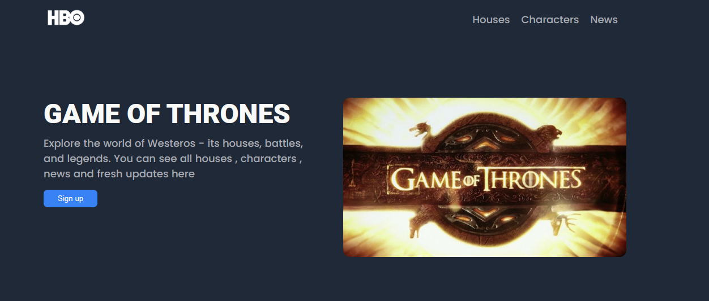

# Landing Page | The Odin Project

I made a Multi-section Landing page using flexbox and other css properties. I choosed Game of Thrones theme and included contents of it

## Live Demo
🔗 https://lukman2458.github.io/landing-page/

## Preview

## What I Learned
- Using Nested Flexbox to arrange elements horizontally and vertically
- Structuring a multi-section webpage (hero, grid, quote, CTA)
- Using justify-content and align-items to control spacing and alignment
- Working with other css and flex properties

## Credits:
images by geekforgeek77, davitberikashvili2006, naragami_ai, DarkDaysLately 
on Pinterest
